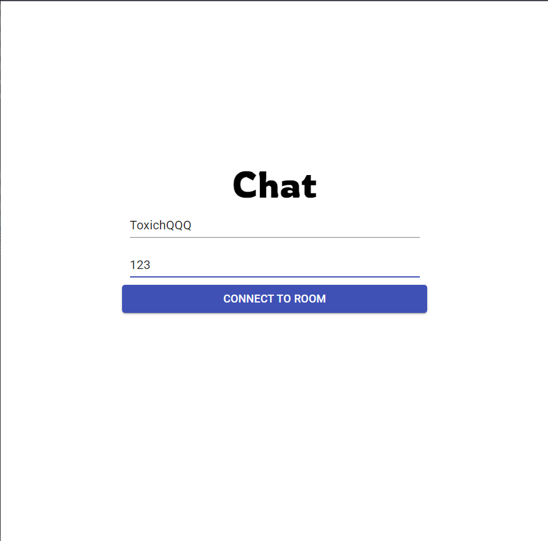
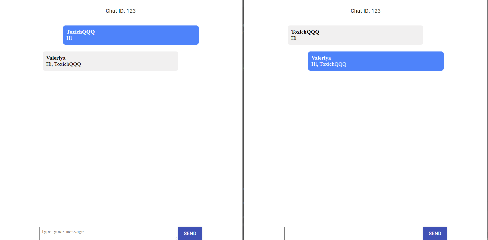

# Simple Chat 

I created a chat for real-time communication 
In the process of writing the chat application, I got acquainted with new technologies

### Start Page

### Chat Room 

## Stack Technologies

- Client
  - React
  - React Router DOM
  - Material UI

- Server
  - Node.js 
  - Socket.io
  - Cors 
  - Express 

## Testing

To test the chat, you need to enter the following commands:

You need to clone the repository using the command:
 
 `git clone git@github.com:ToxichQQQ/SimpleChat.git`

After the repository has been copied, go to the repository and run the `npm install` command. 

Then go to the server folder and do the same

Start the server using the `node server.js`

Start the client using the `npm start`

## Thanks for your attention

You can contact me by this email storozhenko.dev@gmail.com
